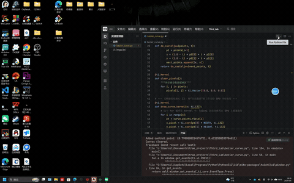
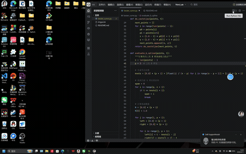

# 贝塞尔曲线与 B 样条曲线渲染器

这是一个使用 Python 和 Taichi 实现的曲线渲染器，支持交互式控制点编辑、实时曲线生成、反走样技术和 B 样条曲线。

## 项目功能

- **交互式控制点编辑**：通过鼠标左键点击添加控制点
- **实时曲线生成**：使用 De Casteljau 算法计算贝塞尔曲线上的点
- **B 样条曲线支持**：实现均匀三次 B 样条曲线，支持局部控制
- **反走样技术**：通过距离衰减模型实现平滑的曲线边缘
- **GPU 加速渲染**：利用 Taichi 的 GPU 并行计算能力，确保流畅的 60 FPS 渲染
- **控制多边形显示**：实时显示控制点之间的连接线
- **模式切换**：按 'b' 键在贝塞尔曲线和 B 样条曲线之间切换
- **清空功能**：按 'c' 键清空所有控制点，重新开始绘制

## 技术实现

- **De Casteljau 算法**：递归实现的贝塞尔曲线计算方法
- **B 样条曲线**：使用 Cox-de Boor 递归公式计算基函数，实现均匀三次 B 样条
- **反走样技术**：通过 3x3 像素邻域的距离计算，实现平滑边缘效果
- **GPU 并行计算**：使用 Taichi 内核进行并行像素渲染
- **批处理优化**：在 CPU 端计算所有曲线点，一次性传输到 GPU
- **固定大小缓冲区**：预分配内存，避免动态内存分配带来的性能开销

## 环境设置

1. **创建并激活 Conda 虚拟环境**：
   ```bash
   # 创建环境，指定 Python 3.12
   conda create -n cg_env python=3.12 -y
   
   # 激活环境
   conda activate cg_env
   ```

2. **安装核心依赖**：
   ```bash
   pip install taichi
   ```

## 使用方法

1. **运行程序**：
   ```bash
   python bezier_curve.py
   ```

2. **交互操作**：
   - **添加控制点**：使用鼠标左键点击画布任意位置
   - **切换曲线模式**：按 'b' 键在贝塞尔曲线和 B 样条曲线之间切换
   - **清空画布**：按键盘上的 'c' 键清除所有控制点

3. **技术细节**：
   - 控制点以红色圆点显示
   - 控制多边形以灰色线条显示
   - 贝塞尔曲线以绿色线条显示
   - B 样条曲线以蓝色线条显示
   - 程序支持最多 100 个控制点

## 性能优化

1. **批处理计算**：在 CPU 端一次性计算所有曲线点
2. **GPU 并行渲染**：使用 Taichi 内核并行处理像素渲染
3. **内存优化**：预分配固定大小的缓冲区，避免动态内存分配
4. **反走样优化**：通过距离计算实现平滑边缘，提升视觉效果

## 项目结构

```
Third_Lab/
├── bezier_curve.py    # 主程序文件
└── README.md          # 项目说明文档
```

## 代码说明

- `de_casteljau()`：实现 De Casteljau 算法的递归函数，用于计算贝塞尔曲线
- `evaluate_b_spline()`：实现 B 样条曲线的计算，使用 Cox-de Boor 递归公式
- `draw_curve_kernel()`：GPU 并行渲染内核，实现反走样效果
- `clear_pixels()`：并行清空像素缓冲区
- `main()`：主函数，处理用户交互和渲染循环

## 运行效果


运行程序后，你将看到一个 800x800 的窗口。点击窗口任意位置添加控制点，程序会实时生成并显示对应的曲线。控制点之间会自动连接形成控制多边形，帮助你理解曲线与控制点的关系。

### 贝塞尔曲线特性
- **全局控制**：移动任何一个控制点都会影响整条曲线的形状
- **通过控制点**：曲线通过第一个和最后一个控制点
- **绿色显示**：贝塞尔曲线以绿色线条显示

### B 样条曲线特性
- **局部控制**：移动一个控制点只会影响曲线的局部区域
- **平滑过渡**：曲线在控制点之间实现平滑过渡
- **蓝色显示**：B 样条曲线以蓝色线条显示
- **最少控制点**：需要至少 4 个控制点才能绘制 B 样条曲线

## 注意事项

- 确保你的系统支持 GPU 加速，以获得最佳性能
- 控制点数量不宜过多，以免影响渲染性能
- 按 'c' 键可以清空画布，重新开始绘制
- 按 'b' 键可以切换曲线模式
- B 样条曲线需要至少 4 个控制点才能正常显示

## 扩展建议

- 实现曲线编辑功能，允许拖动已有的控制点
- 添加颜色选择功能，让用户自定义曲线和控制点的颜色
- 实现曲线导出功能，将生成的曲线保存为 SVG 或其他格式
- 添加更多曲线类型，如 Catmull-Rom 样条曲线
- 实现曲线插值和拟合功能

---

这个项目展示了如何使用 Taichi 进行 GPU 加速的图形渲染，以及如何实现交互式的曲线绘制。通过理解 De Casteljau 算法、B 样条曲线和反走样技术，你可以进一步扩展这个项目，实现更复杂的图形功能。